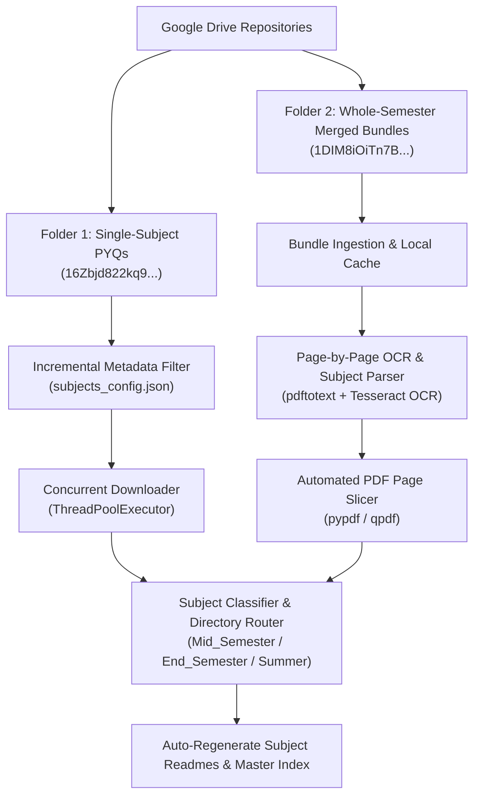

<div align="center">

# 📚 NSUT Study Material & Academic Repository

### *Curated Course Resources, Unit Notes, Problem Sets & Automated PYQ Extraction Engine*

[](LICENSE)
[](https://python.org)
[](https://github.com/tesseract-ocr/tesseract)
[]()

<p align="center">
  <b>A unified, intelligent academic archive for NSUT (ECAM / ECE / ICE / Allied Branches).</b><br>
  Featuring automated Google Drive incremental synchronization, whole-semester multi-subject PDF OCR parsing & slicing, and systematic course categorization.
</p>

</div>

---

## 📖 Course Catalog & Master Index

| # | Subject Code | Subject Name | Key Resources Available |
| :-: | :--- | :--- | :--- |
| 01 | `EAEPC302` | [Signals and Systems](01_Signals_and_Systems_EAEPC302/README.md) | Assignments, downloaded pyqs, downloaded notes, Lecture Slides, Textbooks, Handwritten Notes |
| 02 | `EAEPC303` | [Probability Theory and Random Process](02_Probability_Theory_and_Random_Process_EAEPC303/README.md) | downloaded pyqs, downloaded notes, Textbooks |
| 03 | `EAEPC304` | [Microelectronics Circuits and Applications](03_Microelectronics_Circuits_and_Applications_EAEPC304/README.md) | Lab Manuals and Experiments, Assignments, downloaded pyqs, downloaded notes, Lecture Slides Prof Razavi |
| 04 | `EAEPC305` | [Digital Circuits and Systems](04_Digital_Circuits_and_Systems_EAEPC305/README.md) | Assignments, downloaded pyqs, downloaded notes, Syllabus, Textbooks, Handwritten Notes |
| 05 | `EPMTC301` | [Mathematics For Machine Learning](05_Mathematics_For_Machine_Learning_EPMTC301/README.md) | Assignments and Tutorials, downloaded pyqs, downloaded notes |

---

## ⚡ Intelligent Google Drive AutoSync Engine

This repository includes a smart, incremental synchronization pipeline capable of fetching and organizing past year question papers (PYQs) directly from Google Drive repositories without redundant downloads:



### 🚀 Quick Start / AutoSync Commands

```bash
# 1. Run incremental sync for all new papers & bundles
./autosync.sh

# 2. Dry-run preview (see what will be downloaded without writing files)
./autosync.sh --dry-run

# 3. Force re-sync and re-slice all resources
./autosync.sh --force

# 4. Background watch mode (polls Drive every 1 hour)
./autosync.sh --watch 3600

# 5. Rebuild documentation indexes only
./autosync.sh --index-only
```

---

## 📂 Uniform Directory Structure

Every subject directory follows a standardized academic hierarchy:
- `Assignments/` / `Assignments_and_Tutorials/`: Homework problem sets, tutorial sheets, and MIT problem set solutions.
- `downloaded_notes/`: Unit-wise organized lecture notes (Units 1 to 5).
- `downloaded_pyqs/`: University examination question papers categorized into `Mid_Semester/`, `End_Semester/`, and `Summer_Semester/`.
- `Handwritten_Notes/`: Comprehensive batch topper handwritten lecture notes.
- `Lecture_Slides/`: Professor presentation slides and lecture decks.
- `Textbooks/`: Standard reference textbooks (Oppenheim, Morris Mano, Papoulis, Sedra & Smith, Razavi).
- `Lab_Manuals_and_Experiments/`: Laboratory experiment manuals and simulation guidelines.

---

## 🔮 Future Scope & Roadmap: The Ultimate Semester Material Platform

To elevate this repository into an autonomous academic management suite for all engineering semesters, the following roadmap is planned:

### 1. 🤖 AI Multi-Modal Exam Search & Question Bank Extractor
- **Automated Question-Level Splitting**: Use Vision LLMs (e.g. `Qwen2-VL`, `Gemini Flash API`) to dissect full question papers into individual question cards categorized by topic (`Unit 1: Laplace Transform`, `Unit 2: Fourier Series`).
- **Instant Solution Matching**: AI-assisted mapping of past exam questions to corresponding textbook pages and lecture note slides.

### 2. 🌐 Real-Time Web Portal & Interactive Student Dashboard
- **React/Vite Academic Portal**: Web interface with instant full-text search across all PDF lecture notes, textbook chapters, and past papers.
- **1-Click Zip Custom Bundler**: Allow students to pick specific subjects/units and download a single customized revision bundle before exams.

### 3. ☁️ Cloud & Webhook Automation
- **GitHub Actions Daily Sync**: Automated cron workflow to sync Google Drive nightly and commit new papers directly to GitHub with zero local intervention.
- **Telegram / Discord Broadcast Bot**: Notify class channels whenever professors upload new unit notes or when new exam PYQs are archived.

### 4. 📊 Syllabus Coverage & Exam Weightage Analytics
- **Topic Frequency Analyzer**: Parse past 5 years of exam questions to calculate topic recurrence percentages and high-yield study topics.

---

## 🤝 Contributing

Feel free to submit pull requests, open issues for missing course materials, or contribute additional subject notes!

---

## 📜 License

Distributed under the **MIT License**. Maintained with ❤️ by [Punit Ranjan](https://github.com/punitr2007).